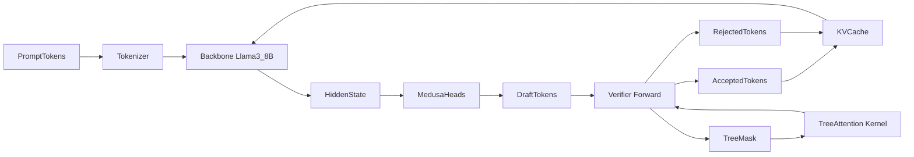
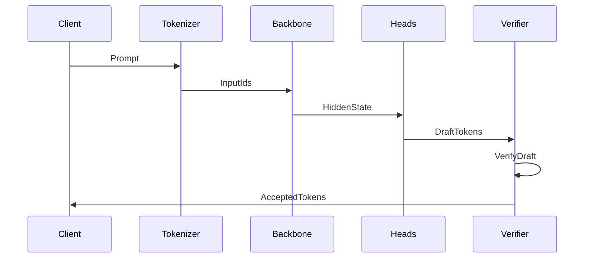

# Project Gorgon

**One-line pitch:** A custom speculative decoding engine for Llama-3-8B with Triton and CUDA kernels, built to prove real ML systems performance chops.

## Highlights
- Medusa-style draft heads + verifier backbone (Llama-3-8B, 4-bit)
- Tree attention kernels in **Triton** and **CUDA**
- End-to-end benchmark harness with reproducible outputs (`.md` + `.jsonl`)
- Streaming demo UI (FastAPI + React) with tree visualization

## Status
- ✅ Kernel microbenchmarks: reference, Triton, CUDA
- ✅ End-to-end benchmark harness + reporting
- ⚠️ Draft head acceptance is low with minimal training
- 🔜 Head training improvements + tree attention verifier integration

## Architecture (High Level)


## Speculative Decoding Flow


## Benchmark Outputs
- Human-readable: `reports/benchmark.md`
- Machine-readable: `reports/benchmark.jsonl`

Each run appends a new Phase 5 section to the Markdown report and a JSON line to the JSONL report.

## Quickstart (WSL2)
1) Create and activate the venv:
```
python3 -m venv ~/venvs/gorgon-impl
source ~/venvs/gorgon-impl/bin/activate
```

2) Install deps:
```
pip install -r requirements.txt -r requirements-dev.txt --extra-index-url https://download.pytorch.org/whl/cu121
```

3) Set Hugging Face token (gated Llama-3):
```
export HF_TOKEN=your_token_here
```

4) Run a small benchmark:
```
python scripts/benchmark_inference.py --num-trials 1 --warmup-steps 0 --max-new-tokens 8 --prompt-max-length 64
```

## Kernel Benchmarks
```
python scripts/benchmark_speed.py --n 256 --d 64 --iters 50 --warmup 5 --device cuda
```

## Repo Layout
- `src/gorgon/kernels/` Triton + CUDA tree attention
- `src/gorgon/inference/` speculative decoding utilities
- `src/gorgon/training/` Medusa head training
- `scripts/benchmark_inference.py` end-to-end benchmark
- `reports/benchmark.md` + `reports/benchmark.jsonl`
- `frontend/` demo UI
- `backend/` WebSocket streaming API

## Notes on Access
Llama-3-8B is gated on Hugging Face. You must request access and use a token with gated repo read permissions.

## Roadmap
- Train Medusa heads on real data (acceptance > 0)
- Integrate tree attention verification in the end-to-end loop
- Full benchmark suite on Llama-3-8B (target >2x speedup)
- Polished demo + blog post
