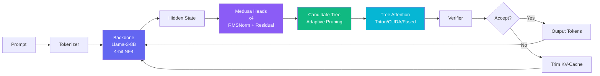
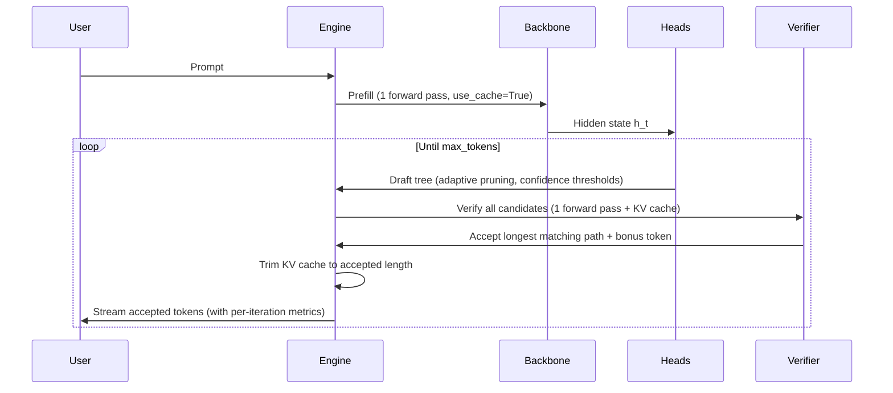

# Project Gorgon

**A speculative decoding engine for Llama-3-8B with custom Triton/CUDA kernels, adaptive tree pruning, and Medusa-style draft heads.**

> Built from scratch to demonstrate ML systems engineering -- custom GPU kernels, speculative inference with tree-structured attention, and rigorous empirical validation.

---

## What Is This?

Project Gorgon accelerates LLM inference by predicting multiple future tokens in parallel using lightweight Medusa draft heads, then verifying them all in a single backbone forward pass with tree-structured attention. Instead of generating tokens one-by-one, each iteration can yield 2-4 tokens for roughly the cost of one forward pass.

### Key Results

| Metric | Value |
|--------|-------|
| **Backbone** | Llama-3-8B-Instruct (4-bit NF4) |
| **Draft Heads** | 4 Medusa heads (RMSNorm + ResidualBlock + lm_head) |
| **Training** | 30k steps on WikiText, cosine LR with warmup |
| **Tree Attention** | Triton + CUDA + fused mask-free kernel |
| **Adaptive Pruning** | Confidence, path-probability, and entropy-weighted |
| **KV Cache** | Integrated with trim-on-reject |
| **Verification** | Vectorized (single argmax, no GPU syncs in loop) |
| **Test Coverage** | 90 tests across inference, kernels, training, benchmarks |

### Benchmark (H100 80GB, 30k training steps)

| | Baseline | Speculative |
|--|----------|-------------|
| **Tokens/sec** | 35.71 | 23.47 |
| **Time (2560 tok)** | 71.7s | 109.1s |
| **Speedup** | -- | 0.66x |

| Head | Acceptance Rate |
|------|----------------|
| Head 0 (t+1) | 23.2% |
| Head 1 (t+2) | 7.9% |
| Head 2 (t+3) | 5.4% |
| Head 3 (t+4) | 3.2% |

See the [technical writeup](docs/technical_writeup.md) for the full story of how this went from 0.08x to 0.66x across four bug fixes.

## Architecture



### Speculative Decoding Flow



## Highlights

- **Custom GPU Kernels** -- Tree attention in **Triton** (127 LOC), **CUDA** (88 LOC), and a **fused mask-free kernel** (140 LOC) that eliminates the O(N^2) attention mask entirely by walking a compact `parents` array in registers
- **Adaptive Tree Pruning** -- Three pruning strategies that reduce tree size without sacrificing acceptance rate: confidence thresholds, cumulative path-probability products, and entropy-weighted thresholds that let uncertain heads explore more
- **Correct Architecture** -- MedusaHeads include a frozen copy of the backbone's RMSNorm, so untrained heads already approximate the backbone's own predictions. Training only needs to learn the delta for shifted-position prediction
- **Tree-Structured Speculation** -- Cartesian product candidate trees from N Medusa heads with optional budget cap (`max_candidates`), verified in a single forward pass
- **KV Cache Integration** -- Prefill captures cache, verification reuses it, rejected branches are trimmed (not cloned/rolled back)
- **Vectorized Verification** -- Single `argmax` over all logits, single CPU transfer, winning path tracked in one pass
- **Per-Iteration Metrics** -- `IterationStats` captures tree size, accepted length, per-head acceptance, and timing breakdown (draft/verify/trim) for every speculative iteration
- **Research-Grade Training** -- 30k-step distillation with warmup + cosine decay (eta_min=1e-5), gradient clipping, trainable-only optimizer, periodic checkpoint cleanup
- **Ablation & Profiling** -- Grid search over (num_heads, top_k, max_depth, confidence_threshold) with automated result collection; torch.profiler integration exports Chrome traces
- **Benchmark Harness** -- Reproducible benchmarking with JSONL output, system info capture, checkpoint loading, and baseline comparison
- **Live Demo UI** -- React + D3 tree visualization with real-time streaming, metrics dashboard, and interactive prompt input

## Repo Layout

```
src/gorgon/
  inference/
    gorgon_loop.py          # Speculative generation loop (IterationStats, timing, fused kernel)
    tree_candidates.py      # Adaptive tree construction (confidence, path-prob, entropy pruning)
    kv_cache.py             # KV-cache with checkpoint/rollback
  kernels/
    tree_attention_triton.py # Triton tree attention kernel
    tree_attention_ref.py    # PyTorch reference implementation
    tree_attention_cuda.py   # CUDA kernel wrapper (JIT)
    fused_tree_verify_triton.py  # Fused mask-free tree verification kernel
    cuda/
      tree_attention.cu      # Raw CUDA kernel
      tree_attention.cpp     # PyTorch C++ binding
    tree_mask.py             # Vectorized ancestor-based tree mask builder
  models/
    backbone.py              # 4-bit Llama loader, RMSNorm extraction, checkpoint loading
    medusa_heads.py          # MedusaHead (optional RMSNorm + ResidualBlock + lm_head)
  training/
    train_heads.py           # Head training utilities
    medusa_bootstrap.py      # Bootstrap training from prompts
    medusa_distill.py        # All-position + last-token distillation
  data/
    dataset.py               # Streaming dataset + DataLoader factory
  benchmarks/
    cli.py                   # CLI args (--heads-checkpoint, --dry-run, ...)
    inference.py             # Baseline + speculative benchmark (with enhanced metrics)
    runner_core.py           # Trial orchestration
    metrics.py               # Metric computation (tau, per-head acceptance, tree utilization)
    trials.py                # Trial result aggregation
    report.py                # Report rendering (markdown + dict)
    ...

scripts/
  train_medusa_heads.py      # Head training (batching, scheduler, validation, resume)
  benchmark_inference.py     # End-to-end benchmark CLI (with checkpoint loading)
  benchmark_speed.py         # Kernel microbenchmarks
  run_ablations.py           # Ablation grid runner (num_heads x top_k x depth x threshold)
  profile_speculative.py     # torch.profiler wrapper (Chrome trace export)
  plot_training.py           # Training loss curve visualization

configs/
  train_heads.yaml           # Training config (30k steps, 3e-4 LR, 500 warmup)

backend/app/main.py          # FastAPI + WebSocket streaming API
frontend/src/                 # React + D3 demo UI
tests/                        # 90 tests
```

## Quickstart

### Prerequisites

- Python 3.10+
- CUDA 12.x compatible GPU (A100/H100 recommended for training, RTX 4090+ works for inference)
- [Llama-3-8B access](https://huggingface.co/meta-llama/Meta-Llama-3-8B-Instruct) (gated model)

### Setup

```bash
# 1. Clone & create venv
git clone https://github.com/matteso1/ProjectGorgon.git
cd ProjectGorgon
python3 -m venv .venv
source .venv/bin/activate

# 2. Install dependencies
pip install -r requirements.txt -r requirements-dev.txt \
    --extra-index-url https://download.pytorch.org/whl/cu121

# 3. Set HuggingFace token
export HF_TOKEN=your_token_here

# 4. Run tests
pytest tests/ -v --tb=short

# 5. Train Medusa heads (30k steps, ~6h on RTX PRO 6000)
python scripts/train_medusa_heads.py --config configs/train_heads.yaml

# 6. Run benchmark with trained checkpoint
python scripts/benchmark_inference.py \
    --heads-checkpoint checkpoints/medusa_heads_latest.pt \
    --num-trials 5 --warmup-steps 2 --max-new-tokens 128

# 7. Launch demo
uvicorn backend.app.main:app --host 0.0.0.0 --port 8000 &
cd frontend && npm install && npm run dev
```

### Training Config

Training is configured via `configs/train_heads.yaml` (CLI args take precedence):

| Parameter | Default | Description |
|-----------|---------|-------------|
| `max_steps` | 30,000 | Total training steps |
| `learning_rate` | 3e-4 | Peak LR (with cosine decay to 1e-5) |
| `batch_size` | 4 | Samples per step |
| `grad_accum` | 4 | Gradient accumulation (effective batch = 16) |
| `warmup_steps` | 500 | Linear LR warmup before cosine decay |
| `max_grad_norm` | 1.0 | Gradient clipping threshold |
| `save_every` | 2,000 | Checkpoint interval |
| `head_dtype` | bf16 | bf16 for A100/H100, fp16 for V100 |

The optimizer only tracks trainable parameters (frozen RMSNorm is excluded). Periodic checkpoints save heads-only (~4 GB); only `medusa_heads_latest.pt` includes optimizer/scheduler for resume. Old step checkpoints are cleaned up (keep last 3).

### Kernel Microbenchmarks

```bash
python scripts/benchmark_speed.py --n 256 --d 64 --iters 50 --warmup 5 --device cuda
```

### Ablation Study

```bash
# Sweep num_heads, top_k, max_depth, confidence_threshold
python scripts/run_ablations.py \
    --heads-checkpoint checkpoints/medusa_heads_latest.pt \
    --output-dir reports/ablation

# Generates: ablation_results.json, ablation_table.md, ablation_charts.png
```

### Profiling

```bash
# Export Chrome trace for chrome://tracing
python scripts/profile_speculative.py \
    --heads-checkpoint checkpoints/medusa_heads_latest.pt \
    --output reports/speculative_trace.json
```

## How It Works

### 1. Medusa Draft Heads

Each Medusa head consists of a **frozen RMSNorm** (copied from the backbone), a **ResidualBlock** (Linear + SiLU + skip connection), and a bias-free **lm_head** projection (initialized from the backbone's own lm_head).

```
hidden_state (pre-norm)
  -> RMSNorm (frozen copy of backbone's model.norm)
  -> ResidualBlock (Linear + SiLU + skip)
  -> lm_head (initialized from backbone)
  -> logits
```

Head *k* predicts the token at position *t + k*. The frozen RMSNorm means that at initialization (before any training), each head already approximates the backbone's own next-token prediction. Training only needs to learn the delta for shifted positions. This dramatically improves convergence -- the heads start from a strong baseline rather than random noise.

### 2. Tree-Structured Verification

Instead of verifying candidates one-by-one, we run a single backbone forward pass over **all** candidate tokens simultaneously. The tree attention mask ensures each candidate only attends to its ancestors in the tree, maintaining causal consistency. The mask is built with vectorized ancestor propagation in O(depth) iterations.

An optional `max_candidates` budget caps the tree size by expanding only the highest-scoring parents at each level.

### 3. Adaptive Tree Pruning

Three strategies reduce tree size without sacrificing quality:

- **Confidence threshold**: Prune candidates with softmax probability below a threshold. Removes low-confidence branches early.
- **Path-probability product**: Track the cumulative probability along each root-to-leaf path. Deep branches with low cumulative confidence are pruned, focusing compute on likely sequences.
- **Entropy-weighted thresholds**: Scale the pruning threshold by `(1 - normalized_entropy)` per head. Heads that are uncertain (high entropy) get lower thresholds, allowing broader exploration. Confident heads are pruned more aggressively.

### 4. Custom GPU Kernels

Three implementations of tree attention, each targeting different tradeoffs:

- **Triton kernel**: Parameterized by `BLOCK_N` and `BLOCK_D`, with masked softmax. Flexible and portable.
- **CUDA kernel**: Shared-memory softmax with per-block parallelism. Maximum control over memory layout.
- **Fused mask-free kernel**: Eliminates the O(N^2) boolean attention mask entirely. Instead of materializing an (N, N) mask tensor, the kernel walks a compact `parents` int32 array (N elements) in registers to compute ancestor relationships on-the-fly. The ancestor walk unrolls at compile time via `tl.static_range`. For typical Medusa trees (depth 3-5, N < 100), this is 3-5 scalar loads per row versus reading N booleans.

### 5. Greedy Acceptance with KV Cache

The verifier's logits are compared against each candidate path. The **longest matching prefix** is accepted, giving us multiple tokens from a single verification pass. We also get a free **bonus token** -- the verifier's own prediction at the last accepted position.

The KV cache from prefill is carried through the loop. After verification, the cache is trimmed to only the accepted positions, avoiding full recomputation.

### 6. Per-Iteration Instrumentation

Every speculative iteration records an `IterationStats` with:
- `tree_size` and `accepted_length` for computing tree utilization
- `head_acceptance: List[bool]` per head for per-head acceptance rates
- `time_draft_ms`, `time_verify_ms`, `time_kv_trim_ms` for timing breakdown

Aggregate metrics computed from iteration stats:
- **Mean accepted length (tau)**: Average tokens accepted per iteration
- **Per-head acceptance rates**: How often each head's predictions are accepted
- **Tree utilization**: Fraction of tree nodes that were actually accepted

## Benchmark Outputs

```bash
# Run with trained heads
python scripts/benchmark_inference.py \
    --heads-checkpoint checkpoints/medusa_heads_latest.pt \
    --num-trials 5 --warmup-steps 2 --max-new-tokens 128

# Machine-readable results
cat reports/benchmark.jsonl | python -m json.tool

# Each run captures: system info, config, baseline/speculative metrics,
# speedup, per-head acceptance, tree utilization, timing breakdown
```

## License

MIT License. See [LICENSE](LICENSE).
