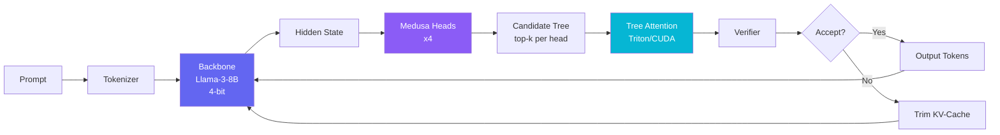
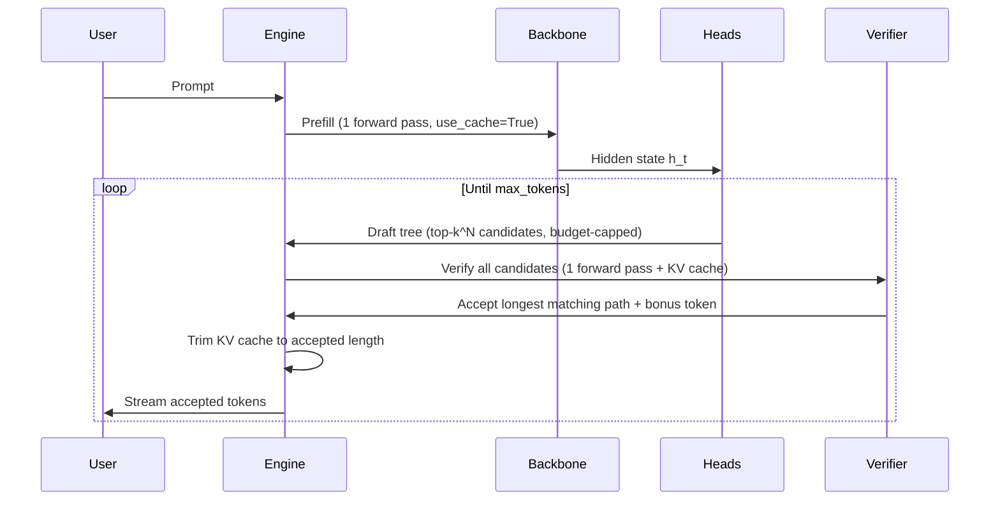

# Project Gorgon

**A custom speculative decoding engine for Llama-3-8B with Triton/CUDA kernels and Medusa-style draft heads.**

> Built to demonstrate real ML systems performance engineering -- custom GPU kernels, speculative inference, and end-to-end benchmarking.

---

## What Is This?

Project Gorgon is a **speculative decoding inference engine** that accelerates LLM generation by predicting multiple future tokens in parallel using lightweight Medusa draft heads, then verifying them all in a single backbone forward pass with tree-structured attention.

### Key Results

| Metric | Value |
|--------|-------|
| **Backbone** | Llama-3-8B (4-bit NF4) |
| **Draft Heads** | 4 Medusa heads (ResidualBlock + lm_head) |
| **Tree Attention** | Triton + CUDA kernels |
| **KV Cache** | Integrated with trim-on-reject |
| **Verification** | Vectorized (single argmax, no GPU syncs in loop) |
| **Benchmark** | Reproducible JSONL reports |

## Architecture



### Speculative Decoding Flow



## Highlights

- **Custom GPU Kernels** -- Tree attention implemented in both **Triton** (127 LOC) and **CUDA** (88 LOC), with correctness verified against a PyTorch reference
- **Tree-Structured Speculation** -- Cartesian product candidate trees from N Medusa heads with optional budget cap (`max_candidates`), verified in a single forward pass
- **KV Cache Integration** -- Prefill captures cache, verification reuses it, rejected branches are trimmed (not cloned/rolled back)
- **Vectorized Verification** -- Single `argmax` over all logits, single CPU transfer, winning path tracked in one pass (no redundant second loop)
- **Research-Grade Training** -- Residual MedusaHead architecture, LR scheduling (warmup + cosine), gradient clipping, validation, checkpoint management with cleanup
- **All-Position Distillation** -- Head k trains on `hidden[:, :-k, :]` -> `targets[:, k:]`, using every sequence position instead of just the last token
- **Benchmark Harness** -- Reproducible benchmarking with JSONL output, system info capture, and baseline comparison
- **Live Demo UI** -- React + D3 tree visualization with real-time streaming, metrics dashboard, and interactive prompt input

## Repo Layout

```
src/gorgon/
  inference/
    gorgon_loop.py          # Core speculative generation loop (KV cache, vectorized verify)
    tree_candidates.py      # Tree-structured candidate generation (sparse budget support)
    kv_cache.py             # KV-cache with checkpoint/rollback
  kernels/
    tree_attention_triton.py # Triton tree attention kernel
    tree_attention_ref.py    # PyTorch reference implementation
    tree_attention_cuda.py   # CUDA kernel wrapper (JIT)
    cuda/
      tree_attention.cu      # Raw CUDA kernel
      tree_attention.cpp     # PyTorch C++ binding
    tree_mask.py             # Vectorized ancestor-based tree mask builder
  models/
    backbone.py              # 4-bit Llama loader + lm_head weight init
    medusa_heads.py          # ResidualBlock + MedusaHead architecture
  training/
    train_heads.py           # Head training utilities
    medusa_bootstrap.py      # Bootstrap training from prompts
    medusa_distill.py        # All-position + last-token distillation
  data/
    dataset.py               # Streaming dataset + DataLoader factory
  benchmarks/                # Benchmark harness
    inference.py             # Baseline + speculative benchmark
    runner_core.py           # Trial orchestration
    ...

scripts/
  benchmark_inference.py     # End-to-end benchmark CLI
  benchmark_speed.py         # Kernel microbenchmarks
  train_medusa_heads.py      # Head training script (batching, scheduler, validation)

configs/
  train_heads.yaml           # Training config defaults

backend/app/main.py          # FastAPI + WebSocket streaming API
frontend/src/                # React + D3 demo UI
tests/                       # 69 tests
```

## Quickstart

### Prerequisites

- Python 3.10+
- CUDA 12.x compatible GPU (A100 40GB+ recommended for full training, 4090 16GB works for dry runs)
- [Llama-3-8B access](https://huggingface.co/meta-llama/Meta-Llama-3-8B-Instruct) (gated model)

### Setup

```bash
# 1. Clone & create venv
git clone https://github.com/matteso1/ProjectGorgon.git
cd ProjectGorgon
python3 -m venv .venv
source .venv/bin/activate

# 2. Install dependencies
pip install -r requirements.txt -r requirements-dev.txt \
    --extra-index-url https://download.pytorch.org/whl/cu121

# 3. Set HuggingFace token
export HF_TOKEN=your_token_here

# 4. Run tests
pytest tests/ -v --tb=short

# 5. Train Medusa heads
python scripts/train_medusa_heads.py --config configs/train_heads.yaml

# Or with CLI overrides:
python scripts/train_medusa_heads.py \
    --steps 500 --lr 1e-4 --dataset wikitext \
    --batch-size 4 --grad-accum 4 --warmup-steps 50

# 6. Run benchmark
python scripts/benchmark_inference.py \
    --num-trials 3 --warmup-steps 1 --max-new-tokens 32

# 7. Launch demo
uvicorn backend.app.main:app --host 0.0.0.0 --port 8000 &
cd frontend && npm install && npm run dev
```

### Training Config

Training is configured via `configs/train_heads.yaml` or CLI args (CLI takes precedence):

| Parameter | Default | Description |
|-----------|---------|-------------|
| `batch_size` | 4 | Samples per step |
| `grad_accum` | 4 | Gradient accumulation steps (effective batch = 16) |
| `warmup_steps` | 50 | Linear LR warmup before cosine decay |
| `max_grad_norm` | 1.0 | Gradient clipping threshold |
| `save_every` | 100 | Checkpoint interval (heads-only periodic, full latest for resume) |
| `head_dtype` | bf16 | bf16 for A100/H100, fp16 for V100 |

Periodic checkpoints save heads-only (~4 GB) to avoid the ~17 GB optimizer state. Only `medusa_heads_latest.pt` includes optimizer/scheduler for resume. Old step checkpoints are cleaned up (keep last 3).

### Kernel Microbenchmarks

```bash
python scripts/benchmark_speed.py --n 256 --d 64 --iters 50 --warmup 5 --device cuda
```

## How It Works

### 1. Medusa Draft Heads

Each Medusa head is a `ResidualBlock` (Linear + SiLU + skip connection) followed by a bias-free `lm_head` projection. Head *k* predicts the token at position *t + k*. The `lm_head` weights are initialized from the backbone's own `lm_head`, giving heads a strong starting point. During inference, we take the top-k predictions from each head and form a **candidate tree**.

### 2. Tree-Structured Verification

Instead of verifying candidates one-by-one, we run a single backbone forward pass over **all** candidate tokens simultaneously. The tree attention mask ensures each candidate only attends to its ancestors in the tree, maintaining causal consistency. The mask is built with vectorized ancestor propagation in O(depth) iterations.

An optional `max_candidates` budget caps the tree size by expanding only the highest-scoring parents at each level.

### 3. Greedy Acceptance with KV Cache

The verifier's logits are compared against each candidate path (root to leaf). The **longest matching prefix** is accepted, giving us multiple tokens from a single verification pass. We also get a free **bonus token** -- the verifier's own prediction at the last accepted position.

The KV cache from prefill is carried through the loop. After verification, the cache is trimmed to only the accepted positions, avoiding the cost of full recomputation.

### 4. Custom GPU Kernels

Tree attention is implemented as a fused kernel in both Triton and CUDA:

- **Triton kernel**: Parameterized by `BLOCK_N` and `BLOCK_D`, with masked softmax and output accumulation
- **CUDA kernel**: Shared-memory softmax with per-block parallelism

## Benchmark Outputs

```bash
# Machine-readable results
cat reports/benchmark.jsonl | python -m json.tool

# Each run captures: system info, config, baseline/speculative metrics, speedup
```

## License

MIT License. See [LICENSE](LICENSE).
