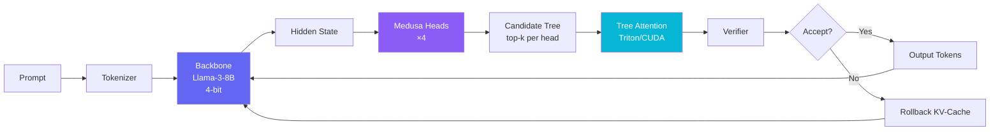
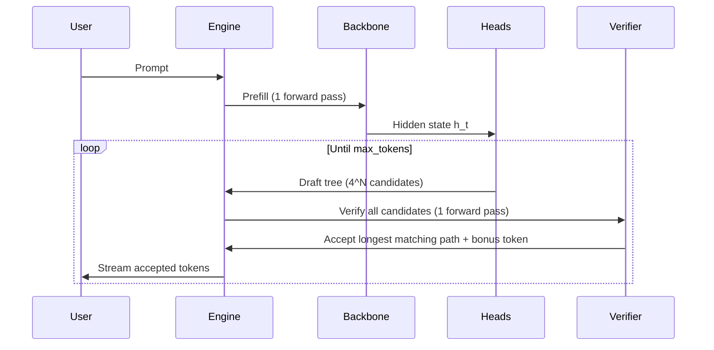

# Project Gorgon 🐍

**A custom speculative decoding engine for Llama-3-8B with Triton/CUDA kernels and Medusa-style draft heads.**

> Built to demonstrate real ML systems performance engineering — custom GPU kernels, speculative inference, and end-to-end benchmarking.

[](https://github.com/YOUR_USERNAME/project-gorgon/actions)

---

## What Is This?

Project Gorgon is a **speculative decoding inference engine** that accelerates LLM generation by predicting multiple future tokens in parallel using lightweight Medusa draft heads, then verifying them all in a single backbone forward pass with tree-structured attention.

### Key Results

| Metric | Value |
|--------|-------|
| **Backbone** | Llama-3-8B (4-bit NF4) |
| **GPU** | NVIDIA RTX 4090 |
| **Draft Heads** | 4 Medusa heads |
| **Tree Attention** | Triton + CUDA kernels |
| **Benchmark** | Reproducible JSONL reports |

## Architecture



### Speculative Decoding Flow



## Highlights

- **🔥 Custom GPU Kernels** — Tree attention implemented in both **Triton** (127 LOC) and **CUDA** (88 LOC), with correctness verified against a PyTorch reference
- **🌳 Tree-Structured Speculation** — Cartesian product candidate trees from N Medusa heads, verified in a single forward pass
- **⚡ Iterative Decoding Loop** — Full speculative generation with KV-cache checkpoint/rollback across iterations
- **📊 Benchmark Harness** — Reproducible benchmarking with JSONL output, system info capture, and baseline comparison
- **🖥️ Live Demo UI** — React + D3 tree visualization with real-time streaming, metrics dashboard, and interactive prompt input
- **🧠 Head Training** — Config-driven training pipeline with checkpoint save/load and streaming dataset support

## Repo Layout

```
src/gorgon/
├── inference/
│   ├── gorgon_loop.py          # Core speculative generation loop
│   ├── tree_candidates.py      # Tree-structured candidate generation
│   └── kv_cache.py             # KV-cache with checkpoint/rollback
├── kernels/
│   ├── tree_attention_triton.py # Triton tree attention kernel
│   ├── tree_attention_ref.py    # PyTorch reference implementation
│   ├── tree_attention_cuda.py   # CUDA kernel wrapper (JIT)
│   ├── cuda/
│   │   ├── tree_attention.cu    # Raw CUDA kernel
│   │   └── tree_attention.cpp   # PyTorch C++ binding
│   └── tree_mask.py             # Ancestor-based tree mask builder
├── models/
│   ├── backbone.py              # 4-bit Llama loader (bitsandbytes)
│   └── medusa_heads.py          # Medusa draft head architecture
├── training/
│   ├── train_heads.py           # Head training utilities
│   ├── medusa_bootstrap.py      # Bootstrap training from prompts
│   └── medusa_distill.py        # Knowledge distillation training
├── data/
│   └── dataset.py               # Streaming dataset (RedPajama/C4)
└── benchmarks/                  # 19-file benchmark harness
    ├── inference.py             # Baseline + speculative benchmark
    ├── runner_core.py           # Trial orchestration
    └── ...

scripts/
├── benchmark_inference.py       # End-to-end benchmark CLI
├── benchmark_speed.py           # Kernel microbenchmarks
└── train_medusa_heads.py        # Head training script

backend/app/main.py              # FastAPI + WebSocket streaming API
frontend/src/                    # React + D3 demo UI
tests/                           # 49 test files
```

## Quickstart

### Prerequisites

- Python 3.10+
- CUDA 12.x compatible GPU
- [Llama-3-8B access](https://huggingface.co/meta-llama/Meta-Llama-3-8B-Instruct) (gated model)

### Setup (WSL2 recommended)

```bash
# 1. Clone & create venv
git clone https://github.com/YOUR_USERNAME/project-gorgon.git
cd project-gorgon
python3 -m venv ~/venvs/gorgon
source ~/venvs/gorgon/bin/activate

# 2. Install dependencies
pip install -r requirements.txt -r requirements-dev.txt \
    --extra-index-url https://download.pytorch.org/whl/cu121

# 3. Set HuggingFace token
export HF_TOKEN=your_token_here

# 4. Run tests
pytest tests/ -v --tb=short

# 5. Train Medusa heads (30-60 min on RTX 4090)
python scripts/train_medusa_heads.py \
    --steps 500 --lr 1e-4 --dataset redpajama --save-every 50

# 6. Run benchmark
python scripts/benchmark_inference.py \
    --num-trials 3 --warmup-steps 1 --max-new-tokens 32

# 7. Launch demo
uvicorn backend.app.main:app --host 0.0.0.0 --port 8000 &
cd frontend && npm install && npm run dev
```

### Kernel Microbenchmarks

```bash
python scripts/benchmark_speed.py --n 256 --d 64 --iters 50 --warmup 5 --device cuda
```

## How It Works

### 1. Medusa Draft Heads

Each Medusa head is a lightweight 2-layer MLP (`Linear → SiLU → Linear`) that maps the backbone's hidden state to a vocabulary distribution. Head *k* predicts the token at position *t + k*. During inference, we take the top-k predictions from each head and form a **candidate tree** (Cartesian product).

### 2. Tree-Structured Verification

Instead of verifying candidates one-by-one, we run a single backbone forward pass over **all** candidate tokens simultaneously. The tree attention mask ensures each candidate only attends to its ancestors in the tree, maintaining causal consistency.

### 3. Greedy Acceptance

The verifier's logits are compared against each candidate path (root → leaf). The **longest matching prefix** is accepted, giving us multiple tokens from a single verification pass. We also get a free **bonus token** — the verifier's own prediction at the last accepted position.

### 4. Custom GPU Kernels

Tree attention is implemented as a fused kernel in both Triton and CUDA:

- **Triton kernel**: Parameterized by `BLOCK_N` and `BLOCK_D`, with masked softmax and output accumulation
- **CUDA kernel**: Shared-memory softmax with per-block parallelism

## Benchmark Outputs

```bash
# Machine-readable results
cat reports/benchmark.jsonl | python -m json.tool

# Each run captures: system info, config, baseline/speculative metrics, speedup
```

## Technical Writeup

See [`docs/technical_writeup.md`](docs/technical_writeup.md) for a deep dive into the architecture, optimization decisions, and performance analysis.

## License

MIT License. See [LICENSE](LICENSE).
